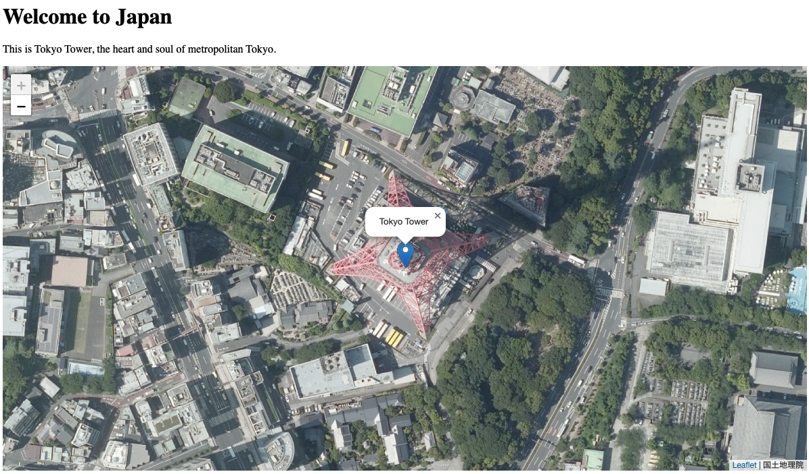

# Part 1: Webマップを作ってみよう！

<kbd></kbd>

[Intro to Mapping Workshop](https://docs.google.com/presentation/d/1vaPlgmhVfbVCEJ8cePac41SkdhDw1ajmvGmDPMUVWwY/edit#slide=id.g26d7eabae8b_0_0)

## Step 1

デスクトップまたはコンピュータ上の任意の場所に「map」フォルダを作成します。 ここに、このワークショップ用のファイルを保存します。

## Step 2

VSCodeを開きます。VSCode をお持ちでない場合は、ここからダウンロードできます:

   - [VSCode](https://code.visualstudio.com/download)

## Step 3

1. 「フォルダーを開く」をクリックします
1. ステップ 1 で作成した「map」フォルダーに移動します。
1. 以下に示すように、「新規ファイル」ボタンをクリックします。


<kbd></kbd>

4. ファイル名を「map.html」にします。

VSCode は次のようになります。

<kbd></kbd>

## Step 4

次のコードをコピーして貼り付けます。


```html
<!DOCTYPE html>
<html lang="en">
<head>
	<meta charset="UTF-8">
	<meta name="viewport" content="width=device-width, initial-scale=1.0">
	<title>Leaflet Map Example</title>
	<!-- LeafletのCSS -->
	<link rel="stylesheet" href="https://unpkg.com/leaflet@1.9.4/dist/leaflet.css" />
</head>
<body>
	<!-- 地図を表示するためのコンテナ -->
	<div id="map" style="width: 100%; height: 600px;"></div>

	<!-- LeafletのJavaScript -->
	<script src="https://unpkg.com/leaflet@1.9.4/dist/leaflet.js"></script>

	<!-- 地図の初期化スクリプト -->
	<script>
		// 地図の中心となる緯度と経度
		var latlon = [35.6585, 139.7454];

		// 地図を作成
		var map = L.map('map').setView(latlon, 18);

		// ベースマップ（航空写真）を追加
		L.tileLayer('https://cyberjapandata.gsi.go.jp/xyz/seamlessphoto/{z}/{x}/{y}.jpg', {
			attribution: '国土地理院'
		}).addTo(map);

		// マーカーを追加
		L.marker(latlon).addTo(map)
			.bindPopup("東京タワー")
			.openPopup();
	</script>
</body>
</html>

```

## Step 5

ファイルを保存します。 デスクトップ (または使用することを選択した場所) で「map.html」ファイルを見つけてダブルクリックします。ブラウザーでマップが現れるはず！

## Step 6

マップをカスタマイズしよう。まずは地球上の好みの場所の緯度と経度を調べます。

Googleマップにアクセス: [https://www.google.com/maps](https://www.google.com/maps)

場所を検索またはそこに移動。

地図で見つけた場所を右クリックして座標を選択（自動的にクリップボードにコピーされます）。

<kbd></kbd>

## Step 7

コード内の緯度と経度の座標を、Google マップからコピーした数値に置き換えて、ファイルをセーブして、もう一度ブラウザーに戻り、リフレッシュ！


## Step 8

いくつかのチャレンジ演習:

- タイトルと説明を追加しよう (HTML タグ `<h1></h1>`、`<p></p>` を使用する)。
- ポップアップウィンドウ（bindPopup）のテキストを変更する
- 複数のマーカーを地図に追加する
- 地図に円を追加する (以下の例、半径はピクセル単位です)

```
// add a circle 
L.circleMarker(latlon,{radius:100}).addTo(map)
```

## Step 9

地図のスクリーンショットを撮り、この Google スライドに投稿しよう！

[Google Slides](https://docs.google.com/presentation/d/1rTvHOYbw_6Ghe2DUFVIWSTxmtYxGbS0_tU8WJZCJ2y4/edit?usp=sharing)

## Discussion

- 今作成したものがどのように役立つかどうかの理由を説明してください
- 「インタラクティブ」マップは普通の地図とどのような【違い】があるのでしょうか?
- マップに追加したい機能について話し合う
- このタイプのデータ視覚化 (つまり、マップベース) を興味のある分野でどのように使用できるかを詳しく語り合おう。

# Part 2: Humanitarian Mapathon

[Mapathon Tutorial](<data/2024 Mapathon Quick Guide - Japanese.pdf>)

# Part 3: 災害マップチャレンジ

The data:

Download: [Historical data (csv)](<data/Historical Disasters.csv>)

- Go to [https://keperl.gl](https://keperl.gl)
- Upload csv file
- Recreate this map:

