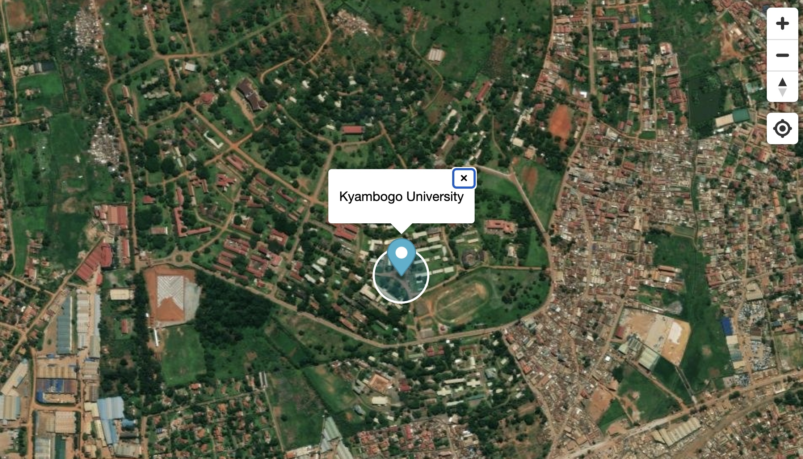
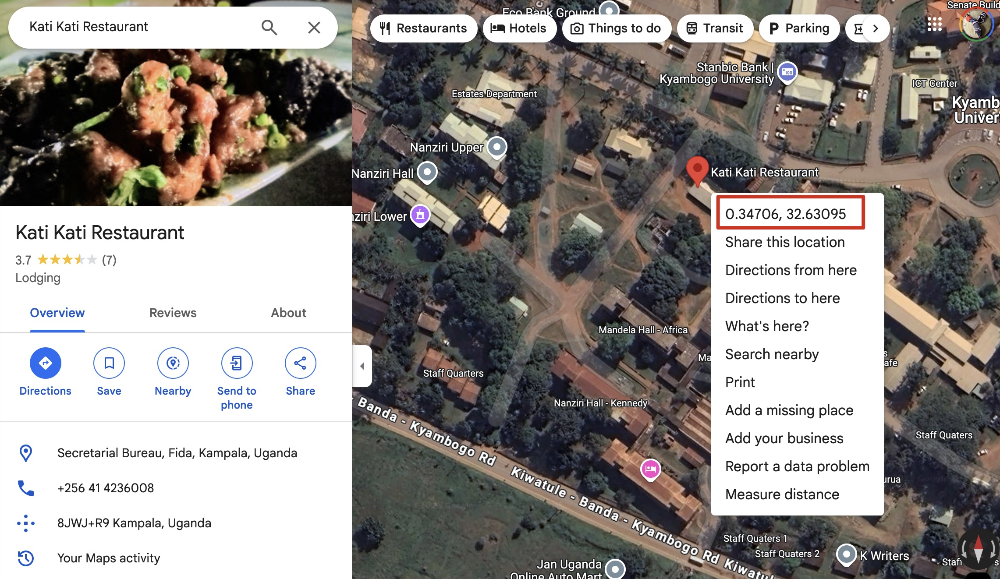

# Part 1: Let's Create a Web Map!

<kbd></kbd>


## Step 1

Create a "map" folder on your desktop or any location on your computer. This is where we'll save files for this workshop.

## Step 2

Open VSCode. If you don't have VSCode, you can download it here:

   - [VSCode](https://code.visualstudio.com/download)

## Step 3

1. Click "Open Folder"
1. Navigate to the "map" folder you created in Step 1
1. Click the "New File" button as shown below

<kbd></kbd>

4. Name the file "map.html"

VSCode should look like this:

<kbd></kbd>

## Step 4

Copy and paste the following code:

```html
<!DOCTYPE html>
<html lang="en">
<head>
    <!-- Basic meta tags for proper rendering and character encoding -->
    <meta charset="UTF-8">
    <meta name="viewport" content="width=device-width, initial-scale=1.0">
    <title>MapLibre Map Example</title>
    
    <!-- MapLibre CSS - Required for map controls and markers -->
    <link href="https://unpkg.com/maplibre-gl@2.4.0/dist/maplibre-gl.css" rel="stylesheet" />
    <style>
        /* Reset default browser margins and ensure full-height layout */
        html, body {
            height: 100%;
            margin: 0;
            padding: 0;
        }
        /* Make map container fill the entire viewport */
        #map {
            width: 100%;
            height: 100vh;
            position: absolute;
            top: 0;
            bottom: 0;
        }
    </style>
</head>
<body>
    <!-- Container div where the map will be rendered -->
    <div id="map"></div>

    <!-- MapLibre GL JS library -->
    <script src="https://unpkg.com/maplibre-gl@2.4.0/dist/maplibre-gl.js"></script>

    <script>
        // Define the coordinates for Kyambogo University (longitude, latitude)
        var latlon = [32.63095230552383,0.34705855705322486];

        // Initialize the map with custom style configuration
        var map = new maplibregl.Map({
            container: 'map',  // ID of the container div
            style: {
                version: 8,  // MapLibre style specification version
                sources: {
                    // Configure the ESRI World Imagery basemap source
                    'esri-world-imagery': {
                        type: 'raster',  // Raster tile source type
                        tiles: [
                            // ESRI aerial imagery tile service URL
                            'https://server.arcgisonline.com/ArcGIS/rest/services/World_Imagery/MapServer/tile/{z}/{y}/{x}'
                        ],
                        tileSize: 256,  // Standard tile size
                        attribution: 'Tiles &copy; Esri &mdash; Source: Esri, i-cubed, USDA, USGS, AEX, GeoEye, Getmapping, Aerogrid, IGN, IGP, UPR-EGP, and the GIS User Community'
                    }
                },
                layers: [{
                    // Define how the basemap should be rendered
                    id: 'esri-world-imagery-layer',
                    type: 'raster',
                    source: 'esri-world-imagery',
                    minzoom: 0,    // Minimum zoom level
                    maxzoom: 22    // Maximum zoom level
                }]
            },
            center: latlon,    // Center the map on Kyambogo University
            zoom: 17          // Initial zoom level
        });

        // Add a marker at Kyambogo University location
        new maplibregl.Marker()
            .setLngLat(latlon)
            .setPopup(new maplibregl.Popup().setHTML("Kyambogo University")) // Add clickable popup
            .addTo(map);
    </script>
</body>
</html>
```

## Step 5

Save the file. Find the "map.html" file on your desktop (or wherever you chose to save it) and double-click it. A map should appear in your browser!

## Step 6

Let's customize the map. First, find the latitude and longitude of your preferred location.

Visit Google Maps: [https://www.google.com/maps](https://www.google.com/maps)

Search for or navigate to a location.

Right-click on the location you found on the map and select coordinates (they'll automatically copy to your clipboard).

<kbd></kbd>

## Step 7

Replace the latitude and longitude coordinates in the code with the numbers you copied from Google Maps. <b>Make sure to switch the latitude and longitude numbers!</b> Save the file, and go back to your browser and refresh!


## Step 8

Some challenge exercises:

- Change the popup window (setPopup) text
- Add multiple markers to the map
- Add a 1km radius circle to the map 
- Add zoom controls
- Add a geolocation control


## Step 9

Take a screenshot of your map and post it to this Google Slides!

[Google Slides](https://docs.google.com/presentation/d/1rTvHOYbw_6Ghe2DUFVIWSTxmtYxGbS0_tU8WJZCJ2y4/edit?usp=sharing)

## Discussion

- Explain why what you created might be useful
- What are the differences between an "interactive" map and a regular map?
- Discuss features you'd like to add to the map
- Share how you could use this type of data visualization (i.e., map-based) in your field of interest

# Part 2: Disaster Map Challenge

The data:

Download: [Historical data (csv)](<data/Historical Disasters.csv>)

- Go to [https://keperl.gl](https://keperl.gl)
- Upload csv file
- Recreate this map:

